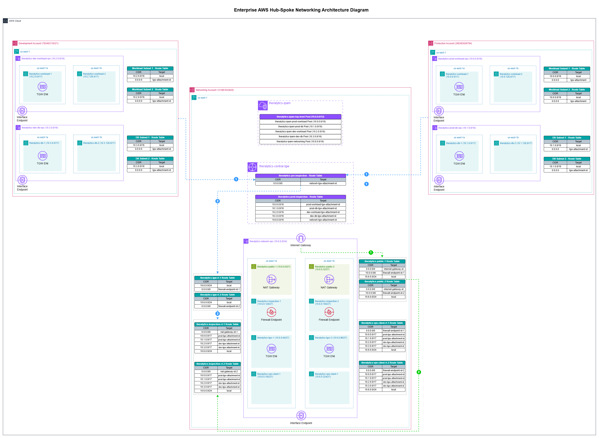

# Enterprise AWS Hub-Spoke Network Blueprint

This repository contains a modular, production-ready Terraform blueprint for implementing an AWS Hub-Spoke network topology across multiple environments and accounts.

## Architecture Overview

This infrastructure establishes a secure, robust foundation for scaling AWS environments. It organizes network components into a central **Hub** (networking account) and multiple **Spokes** (dev and prod accounts).

- **Networking (Hub):** Consists of a central VPC for inspection, NAT Gateways, Transit Gateway (TGW), and an AWS IPAM (IP Address Manager).
- **Environments (Spokes):** `dev` and `prod` environments each feature separate Workload and Database VPCs, receiving unique CIDR blocks dynamically allocated by the Hub IPAM. Spoke routing is tightly governed, funneling necessary cross-environment or internet traffic through the centralized Transit Gateway.

## Folder Structure

- `envs/`: Deployable root configurations per environment (`dev`, `prod`, `networking`).
- `modules/`: Reusable Terraform components (`ipam`, `vpc`, `tgw_inspection`, etc.) called by the environment roots.

## Deployment Flow

The general operational order is as follows:

1. **Deploy Hub Network:** Initialize and build the `/envs/networking/` root to provision IPAM, central VPC, Transit Gateway, and sharing configurations (using AWS RAM).
2. **Accept Resource Shares:** In the `dev` and `prod` accounts, accept the RAM shares for the TGW and IPAM pools.
3. **Deploy Spoke Environments:** Deploy the `/envs/dev/` and `/envs/prod/` roots, attaching them to the shared IPAM pools for networking structures.
4. **Update Routing:** Once spoke attachments exist, finalize Transit Gateway routing rules back in the `networking` root.

## Instructions
For granular step-by-step guides, please consult the `README.md` inside each environment directory.
